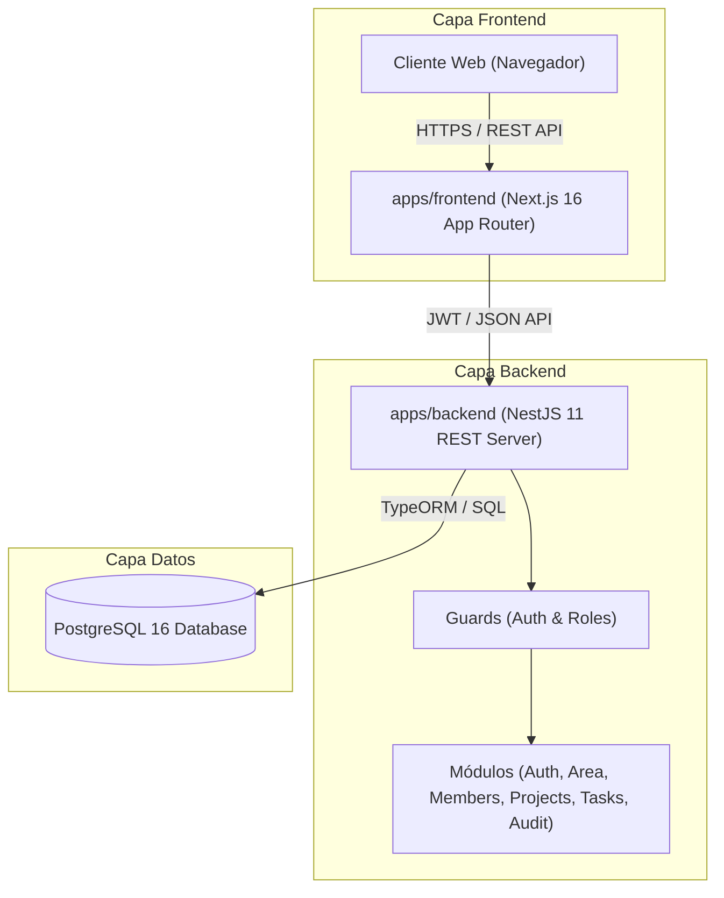
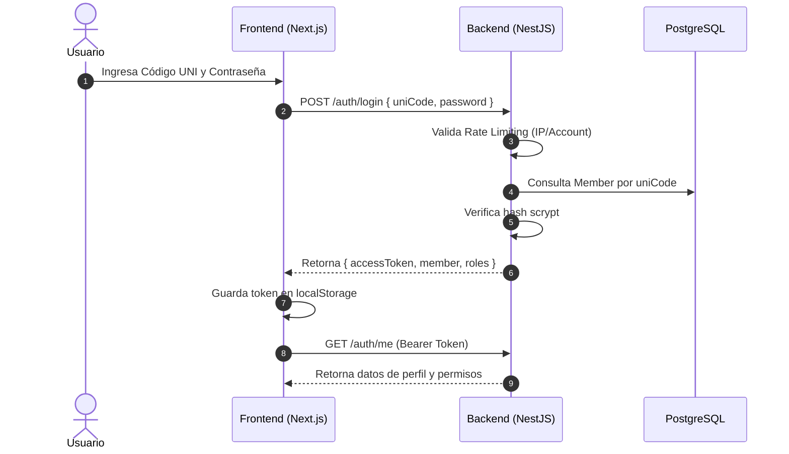
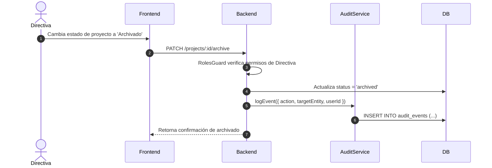

# Arquitectura del Sistema UNICORE

Este documento describe la arquitectura técnica general de **UNICORE**, sus capas, componentes clave, flujos de datos y modelo de seguridad.

---

## 🏗️ Visión General de la Arquitectura

UNICORE está diseñado como una plataforma distribuida en 3 capas alojadas en un monorepo:

---

## 🧱 Componentes Principales

### 1. Capa de Presentación (`apps/frontend`)
* **Next.js 16 (App Router)**: Renderizado dinámico del lado del cliente/servidor.
* **Cliente de API (`auth-client.ts`)**: Encapsula las llamadas HTTP al backend, gestiona tokens JWT en `localStorage` / headers y maneja el refresco de sesión y errores HTTP.
* **Vistas Modulares (`/dashboard`)**:
  * **Personas**: Gestión de miembros, habilidades, áreas y membresías multi-área.
  * **Proyectos**: Gestión de proyectos, fases y conformación de equipos.
  * **Tareas**: Tablero Kanban interactivo, historial de estado y comentarios.
  * **Auditoría**: Visor de registro de acciones del sistema.

### 2. Capa de Servicios y Lógica (`apps/backend`)
* **NestJS 11**: Framework modular que organiza la lógica de negocio en módulos acoplados mediante inyección de dependencias.
* **Autenticación e Identidad**:
  * Servicio de autenticación con JWT (`AuthModule`).
  * Hasheo seguro de contraseñas mediante `scrypt`.
  * Servicio de protección anti-fuerza bruta (`LoginRateLimitService`) que limita intentos fallidos por IP y por cuenta.
* **Sistema de Roles y Seguridad (RBAC)**:
  * **Roles por Área**: `Presidencia` (acceso global), `Directiva de Área` (administra su área y sus proyectos) y `Miembro` (opera en sus proyectos asignados).
  * **Roles por Proyecto**: `Representante`, `Subrepresentante` e `Integrante`.
  * **Guards de NestJS**: `AuthGuard` verifica el token JWT y `RolesGuard` valida los permisos por área/proyecto.

### 3. Capa de Persistencia (`apps/backend/src/migrations`, TypeORM, PostgreSQL)
* **TypeORM 0.3**: Mapeador objeto-relacional para interactuar de forma segura con PostgreSQL.
* **Migraciones**: Control de versiones de esquemas SQL para poblar datos iniciales y adaptar estructuras en producción.

---

## 🔄 Flujos Principales del Sistema

### 1. Flujo de Autenticación y Carga de Sesión

### 2. Flujo de Trazabilidad y Auditoría
Cualquier acción crítica (crear/editar/archivar entidades, cambiar estados de tareas, cambiar miembros) genera automáticamente un evento en `audit_events`:

---

## 🔒 Consideraciones de Seguridad

1. **Sin Secretos en Repositorio**: Toda clave secreta se inyecta por variables de entorno (`.env`).
2. **Confirmación Reforzada de Eliminación**: Para operaciones irreversibles en backend (`DELETE`), se requiere enviar el campo `confirmName` en el body o query matching el nombre exacto de la entidad.
3. **Control de Intentos de Inicio de Sesión**: Rate limiter configurable por ventana de tiempo (60s) limitando intentos concurrentes e IP brutes.
