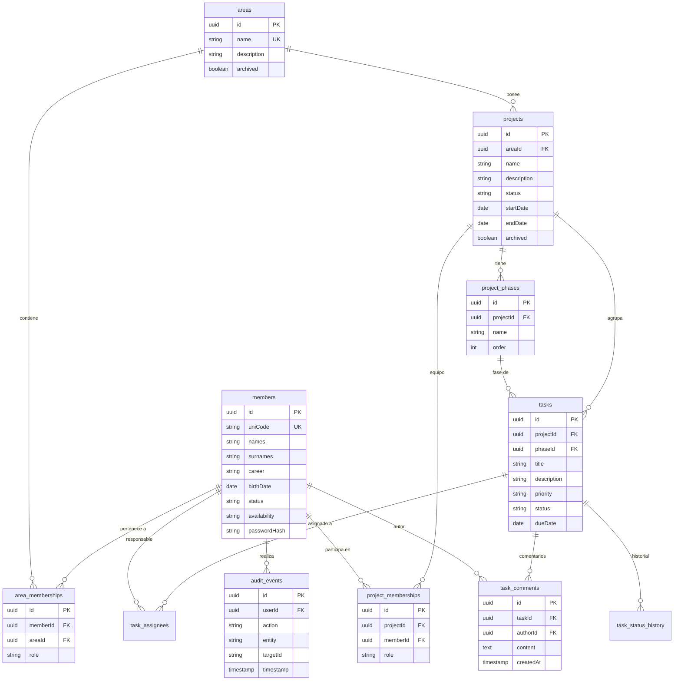

# Documentación de Base de Datos — UNICORE

UNICORE utiliza **PostgreSQL** como motor de base de datos relacional y **TypeORM 0.3** como capa de mapeo e interacción en NestJS.

---

## 📊 Modelo Entidad-Relación (ER)



---

## 🗄️ Detalle de Entidades Principales

### 1. `members` (`Member`)
Almacena los miembros de la comunidad UNICODE.
* **Campos obligatorios**: `uniCode` (Código UNI único), `names`, `surnames`, `career`, `birthDate`, `skills` (relación many-to-many con `Skill`).
* **Estado de Actividad (`status`)**: `active` | `inactive`.
* **Estado de Disponibilidad (`availability`)**: `available` | `unavailable` | `disabled`.
  * `disabled` (Inhabilitado): Bloquea el acceso al sistema pero mantiene todo el historial por trazabilidad.

### 2. `areas` (`Area`)
Representa las áreas organizativas (ej. *Investigación y Desarrollo*, *Proyectos*, *Marketing*).
* Soporta borrado lógico mediante la columna `archived: boolean`.

### 3. `area_memberships` (`AreaMembership`)
Permite la **Membresía Multi-área** (`FR-04`), relacionando un miembro con una o más áreas con un rol específico en cada una.
* **Roles por Área**: `presidencia`, `directiva`, `miembro`.

### 4. `projects` (`Project`)
Proyectos pertenecientes a un área (`areaId`).
* **Estados**: `planning`, `active`, `paused`, `archived`.
* **Conservación**: No se eliminan físicamente; solo se marcan como `archived: true`.

### 5. `project_phases` (`ProjectPhase`)
Fases secuenciales de un proyecto (`order`). Por defecto se crean 4 fases al iniciar un proyecto:
1. Definición de requerimientos
2. Modelado
3. Implementación
4. Despliegue

### 6. `project_memberships` (`ProjectMembership`)
Relación de miembros en el equipo de un proyecto.
* **Roles por Proyecto**: `representante`, `subrepresentante`, `integrante`.

### 7. `tasks` (`Task`)
Tareas creadas dentro de un proyecto y asociadas a una fase.
* **Estados (`status`)**: `todo` | `in_progress` | `in_review` | `done`.
* **Prioridades (`priority`)**: `low` | `medium` | `high` | `urgent`.

### 8. `task_status_history` (`TaskStatusHistory`)
Trazabilidad de cambios de estado en tareas. Guarda el estado anterior, el nuevo estado, quién realizó el cambio (`changedById`) y la marca de tiempo.

### 9. `audit_events` (`AuditEvent`)
Bitácora de auditoría global del sistema para registrar acciones de creación, modificación o archivado de entidades.

---

## ⚙️ Reglas de Migración y `synchronize: true`

> [!IMPORTANT]
> **Configuración en Desarrollo (`synchronize: true`)**:
> En `app.module.ts`, TypeORM tiene activado `synchronize: true` para sincronizar automáticamente las entidades con la base de datos PostgreSQL local durante el desarrollo rápido.

### Migraciones Ejecutadas (`apps/backend/src/migrations/`):
El sistema incluye migraciones de parches y datos de sembrado (seeds):
1. `1787788800000-MigrateMemberRolesAndAreas.ts`: Normalización inicial de roles por área.
2. `1787788800001-RepairMemberAreaMemberships.ts`: Reparación de llaves foráneas en membresías multi-área.
3. `1787788800002-AddTaskCollaboration.ts`: Creación de tablas de comentarios e historial Kanban.
4. `1787788800003-CreateAuditEventsTable.ts`: Creación de la estructura de auditoría de acciones.

Para probar la ejecución de migraciones:
```bash
cd apps/backend
npm run test:migrations
```
