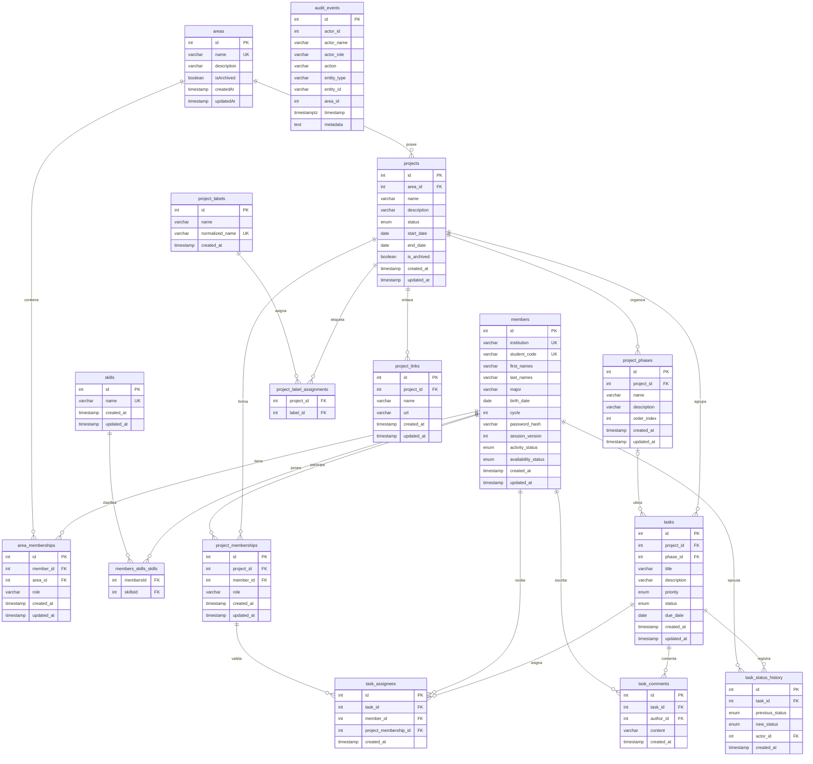

# Documentación de Base de Datos — UNICORE

UNICORE utiliza **PostgreSQL** y **TypeORM 0.3**. Este modelo se deriva de las entidades registradas en `apps/backend/src/`; los identificadores son enteros autoincrementales, no UUID.

## Modelo Entidad-Relación



`audit_events.actor_id` conserva el identificador del actor, pero la entidad no declara una relación TypeORM hacia `members`; por eso no se dibuja como FK en el ER.

## Contratos persistidos y reglas relevantes

### Miembros, habilidades y áreas

- `members` identifica de forma única la combinación `institution + student_code`. Usa `first_names`, `last_names`, `major`, `birth_date`, `activity_status` (`active`, `inactive`) y `availability_status` (`available`, `not_available`, `disabled`).
- `skills.name` es único. La relación muchos-a-muchos se materializa mediante la tabla de unión generada por TypeORM para `Member.skills`.
- `area_memberships` es única por `member_id + area_id`; sus roles válidos son `presidencia`, `directiva_de_area` y `miembro`. `area_id` puede ser nulo para una membresía global de Presidencia.
- `areas.isArchived` implementa archivado lógico.

### Proyectos

- `projects.status` acepta `planned`, `active`, `on_hold`, `completed` y `cancelled`. El archivado es independiente y se expresa con `is_archived = true`.
- Al crear un proyecto se generan, en orden, las fases `Planning`, `Execution`, `Review` y `Launch`.
- `project_memberships` es única por `member_id + project_id`; sus roles persistidos son `representative`, `subrepresentative` y `member`.
- `project_labels` normaliza nombres y se asocia mediante `project_label_assignments`. `project_links` almacena enlaces absolutos pertenecientes a un proyecto.

### Tareas y colaboración

- `tasks.status`: `todo`, `in_progress`, `in_review`, `done`.
- `tasks.priority`: `low`, `medium`, `high`, `urgent`.
- `phase_id` es opcional y usa `SET NULL` al eliminar una fase; `project_id` usa borrado en cascada.
- `task_assignees` es única por `task_id + member_id` y referencia también la membresía del miembro en el proyecto.
- `task_comments` conserva autor y contenido; `task_status_history` conserva estado anterior, nuevo estado y actor.

### Auditoría

`audit_events` usa un `id` entero e incluye `actor_id`, `actor_name`, `actor_role`, `action`, `entity_type`, `entity_id` (varchar), `area_id`, `timestamp` y `metadata` serializada.

## Migraciones y `synchronize`

> [!WARNING]
> `app.module.ts` mantiene actualmente `synchronize: true` y `migrationsRun: true`. Esta combinación facilita desarrollo local, pero `synchronize` debe desactivarse antes de operar en producción y los cambios de esquema deben quedar en migraciones revisadas.

Migraciones registradas:

1. `1787788800000-MigrateMemberRolesAndAreas.ts` — normaliza roles y crea membresías de área.
2. `1787788800001-RepairMemberAreaMemberships.ts` — repara relaciones de membresías.
3. `1787788800002-AddTaskCollaboration.ts` — agrega comentarios e historial de estado.
4. `1787788800003-CreateAuditEventsTable.ts` — crea auditoría.

```bash
cd apps/backend
npm run test:migrations
```
