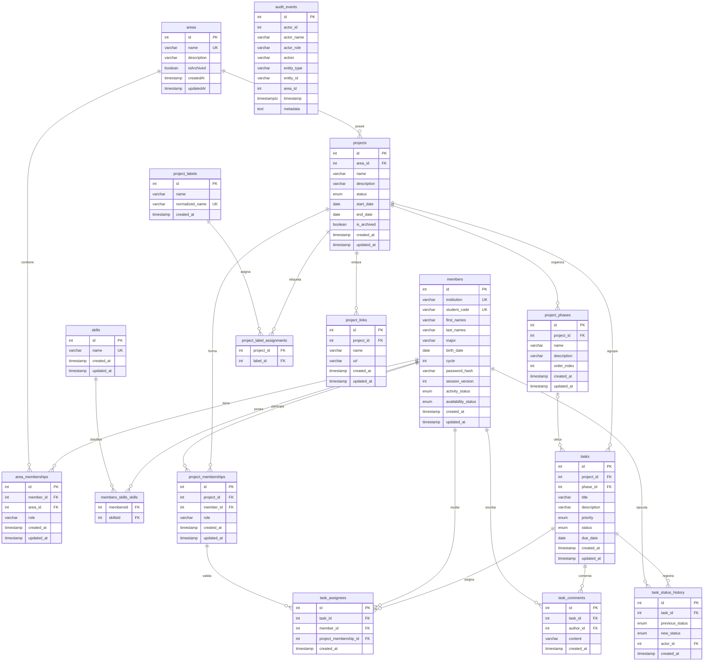

# Documentación de Base de Datos — UNICORE

UNICORE utiliza **PostgreSQL** y **TypeORM 0.3**. Este modelo se deriva de las entidades registradas en `apps/backend/src/`; los identificadores son enteros autoincrementales, no UUID.

## Modelo Entidad-Relación

```mermaid
erDiagram
    members ||--o{ area_memberships : tiene
    areas ||--o{ area_memberships : contiene
    members ||--o{ members_skills_skills : posee
    skills ||--o{ members_skills_skills : clasifica
    areas ||--o{ projects : posee
    projects ||--o{ project_phases : organiza
    projects ||--o{ project_memberships : forma
    members ||--o{ project_memberships : participa
    projects ||--o{ project_label_assignments : etiqueta
    project_labels ||--o{ project_label_assignments : asigna
    projects ||--o{ project_links : enlaza
    projects ||--o{ tasks : agrupa
    project_phases o|--o{ tasks : ubica
    tasks ||--o{ task_assignees : asigna
    members ||--o{ task_assignees : recibe
    project_memberships ||--o{ task_assignees : valida
    tasks ||--o{ task_comments : comenta
    members ||--o{ task_comments : escribe
    tasks ||--o{ task_status_history : registra
    members ||--o{ task_status_history : ejecuta

    members {
        int id PK
        varchar institution UK
        varchar student_code UK
        varchar first_names
        varchar last_names
        varchar major
        date birth_date
        int cycle
        varchar password_hash
        int session_version
        enum activity_status
        enum availability_status
        timestamp created_at
        timestamp updated_at
    }

    skills {
        int id PK
        varchar name UK
        timestamp created_at
        timestamp updated_at
    }

    members_skills_skills {
        int membersId FK
        int skillsId FK
    }

    areas {
        int id PK
        varchar name UK
        varchar description
        boolean isArchived
        timestamp createdAt
        timestamp updatedAt
    }

    area_memberships {
        int id PK
        int member_id FK
        int area_id FK
        varchar role
        timestamp created_at
        timestamp updated_at
    }

    projects {
        int id PK
        int area_id FK
        varchar name
        varchar description
        enum status
        date start_date
        date end_date
        boolean is_archived
        timestamp created_at
        timestamp updated_at
    }

    project_phases {
        int id PK
        int project_id FK
        varchar name
        varchar description
        int order_index
        timestamp created_at
        timestamp updated_at
    }

    project_memberships {
        int id PK
        int project_id FK
        int member_id FK
        varchar role
        timestamp created_at
        timestamp updated_at
    }

    project_labels {
        int id PK
        varchar name
        varchar normalized_name UK
        timestamp created_at
    }

    project_label_assignments {
        int project_id FK
        int label_id FK
    }

    project_links {
        int id PK
        int project_id FK
        varchar name
        varchar url
        timestamp created_at
        timestamp updated_at
    }

    tasks {
        int id PK
        int project_id FK
        int phase_id FK
        varchar title
        varchar description
        enum priority
        enum status
        date due_date
        timestamp created_at
        timestamp updated_at
    }

    task_assignees {
        int id PK
        int task_id FK
        int member_id FK
        int project_membership_id FK
        timestamp created_at
    }

    task_comments {
        int id PK
        int task_id FK
        int author_id FK
        varchar content
        timestamp created_at
    }

    task_status_history {
        int id PK
        int task_id FK
        enum previous_status
        enum new_status
        int actor_id FK
        timestamp created_at
    }

    audit_events {
        int id PK
        int actor_id
        varchar actor_name
        varchar actor_role
        varchar action
        varchar entity_type
        varchar entity_id
        int area_id
        timestamptz timestamp
        text metadata
    }
```

`audit_events.actor_id` conserva el identificador del actor, pero la entidad no declara una relación TypeORM hacia `members`; por eso no se dibuja como FK en el ER.

## Contratos persistidos y reglas relevantes

### Miembros, habilidades y áreas

- `members` identifica de forma única la combinación `institution + student_code`. Usa `first_names`, `last_names`, `major`, `birth_date`, `activity_status` (`active`, `inactive`) y `availability_status` (`available`, `not_available`, `disabled`).
- `skills.name` es único. La relación muchos-a-muchos se materializa mediante la tabla de unión generada por TypeORM para `Member.skills`.
- `area_memberships` es única por `member_id + area_id`; sus roles válidos son `presidencia`, `directiva_de_area` y `miembro`. `area_id` puede ser nulo para una membresía global de Presidencia.
- `areas.isArchived` implementa archivado lógico.

### Proyectos

- `projects.status` acepta `planned`, `active`, `on_hold`, `completed` y `cancelled`. El archivado es independiente y se expresa con `is_archived = true`.
- Al crear un proyecto se generan, en orden, las fases `Planning`, `Execution`, `Review` y `Launch`.
- `project_memberships` es única por `member_id + project_id`; sus roles persistidos son `representative`, `subrepresentative` y `member`.
- `project_labels` normaliza nombres y se asocia mediante `project_label_assignments`. `project_links` almacena enlaces absolutos pertenecientes a un proyecto.

### Tareas y colaboración

- `tasks.status`: `todo`, `in_progress`, `in_review`, `done`.
- `tasks.priority`: `low`, `medium`, `high`, `urgent`.
- `phase_id` es opcional y usa `SET NULL` al eliminar una fase; `project_id` usa borrado en cascada.
- `task_assignees` es única por `task_id + member_id` y referencia también la membresía del miembro en el proyecto.
- `task_comments` conserva autor y contenido; `task_status_history` conserva estado anterior, nuevo estado y actor.

### Auditoría

`audit_events` usa un `id` entero e incluye `actor_id`, `actor_name`, `actor_role`, `action`, `entity_type`, `entity_id` (varchar), `area_id`, `timestamp` y `metadata` serializada.

## Migraciones y configuración por entorno

Solo `NODE_ENV=development` permite `synchronize: true` y omite las migraciones automáticas: las entidades crean el esquema local actual. En producción, pruebas, staging o si no se especifica el entorno, `synchronize` está apagado y el arranque aplica las migraciones pendientes. Configure `NODE_ENV` en el entorno del despliegue; el ejemplo local usa `development`.

El registro único está en `apps/backend/src/database/database-options.ts`. Conserva las ocho migraciones históricas, incluida `NormalizeSearchableText`, y agrega tres pasos de compatibilidad:

- `1787788799998-InitializeSchema`: crea con SQL fijo el esquema inicial en una base vacía; adopta instalaciones con `members` sin recrear sus tablas y rechaza esquemas parciales. Su fecha precede al historial existente para que las ocho migraciones tengan sus tablas disponibles.
- `1787788799999-PrepareSearchNormalization`: conserva temporalmente la columna calculada que pudo haber creado la sincronización antes de la migración de normalización.
- `1787788800008-FinalizeSearchNormalization`: elimina esa copia calculada tras completar la normalización y restaura los índices y la restricción de miembros inhabilitados que la sincronización anterior podía quitar. Los nombres originales y sus asociaciones se conservan; las ocho migraciones anteriores no se reescriben.

La migración inicial no permite rollback automático porque puede adoptar una instalación con datos. Antes de actualizar una base compartida, conserve un respaldo; para volver a una versión anterior restaure el respaldo. Las migraciones nuevas posteriores deben definir una reversión adecuada a sus cambios.

### Crear una migración

1. Use una base de desarrollo desechable, configure `DATABASE_URL` y `DATABASE_SSL=false` en la terminal y ejecute `npm run migration:run --workspace apps/backend`.
2. Modifique las entidades y ejecute desde `apps/backend`: `npm run migration:generate -- src/migrations/NombreDelCambio`; el CLI nunca sincroniza la base.
3. Revise el SQL de `up` y `down`, y registre la clase en `databaseMigrations` de `src/database/database-options.ts`.
4. Ejecute `npm run test:migrations --workspace apps/backend` con `TEST_DATABASE_URL` apuntando a PostgreSQL de pruebas; el usuario necesita permiso para crear bases desechables.
5. Incluya entidad, migración y evidencia en la misma PR: CI comprueba arranque vacío, segundo arranque, actualización con datos y ausencia de diferencias entre entidades y esquema.

La prueba de integración crea bases con nombres `unicore_migration_*` y las elimina al terminar; no vacía la base indicada por `TEST_DATABASE_URL`. El fallo de creación de membresías de UNI2-60 es independiente de la inicialización del esquema.
